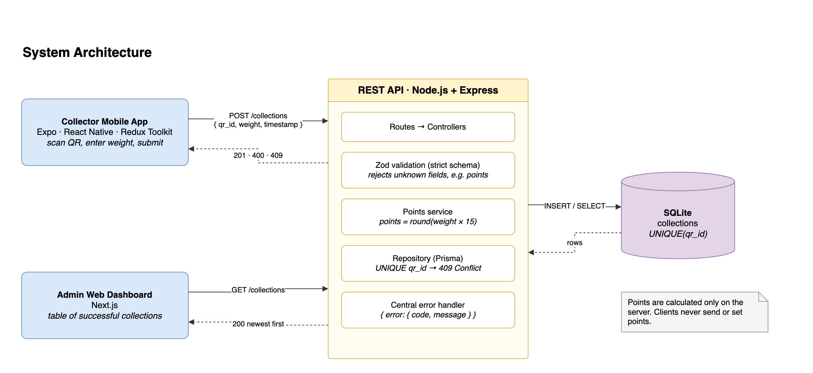
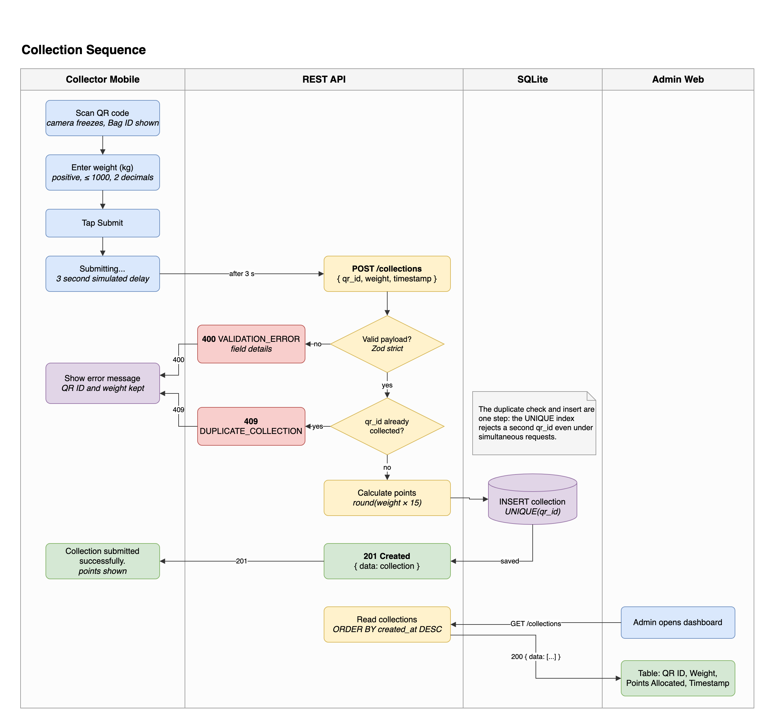
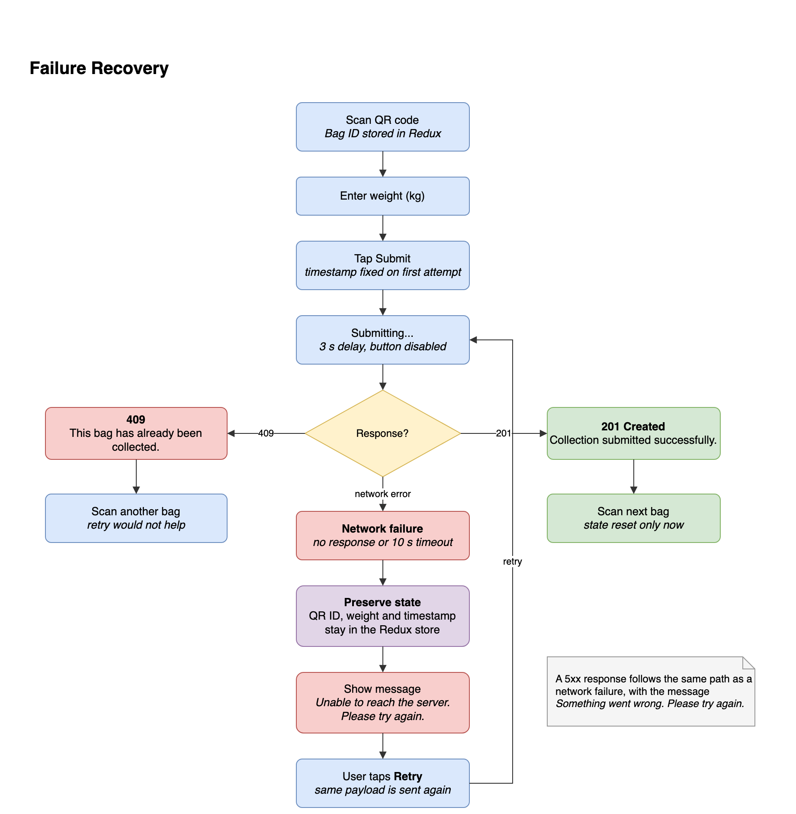

# Diagrams

Each diagram has an editable draw.io source (`.drawio`) and a PNG export. Open the source at [app.diagrams.net](https://app.diagrams.net) or in the draw.io desktop app.

Colour key used in all three: blue for client steps, yellow for API steps and decisions, purple for storage and preserved state, green for success, red for errors.

## 1. System architecture

| Element         | Content                                                                                                                                    |
| --------------- | ------------------------------------------------------------------------------------------------------------------------------------------ |
| Nodes           | Collector Mobile App, REST API (routes, Zod validation, points service, Prisma repository, error handler), SQLite, Admin Web Dashboard     |
| Arrows          | Mobile → API `POST /collections`; API → Mobile `201 · 400 · 409`; Web → API `GET /collections`; API → Web `200 newest first`; API ↔ SQLite |
| Decisions shown | Points are calculated only by the API. Duplicates are rejected by the `UNIQUE(qr_id)` index.                                               |

## 2. Collection sequence

| Element         | Content                                                                                                                                                                                         |
| --------------- | ----------------------------------------------------------------------------------------------------------------------------------------------------------------------------------------------- |
| Lanes           | Collector Mobile, REST API, SQLite, Admin Web                                                                                                                                                   |
| Steps           | Scan QR → enter weight → submit → 3 second delay → `POST /collections` → validation → duplicate check → points calculation → insert → `201` → mobile success → admin `GET /collections` → table |
| Branches        | Invalid payload → `400 VALIDATION_ERROR`; existing `qr_id` → `409 DUPLICATE_COLLECTION`. Both return to the mobile app with the scanned data kept.                                              |
| Decisions shown | The duplicate check and insert happen in one step through the unique index, so simultaneous requests cannot both succeed.                                                                       |

## 3. Failure recovery

| Element         | Content                                                                                                                                                |
| --------------- | ------------------------------------------------------------------------------------------------------------------------------------------------------ |
| Main path       | Scan QR → enter weight → submit → network failure → preserve QR ID, weight and timestamp → show retry message → retry → submitting again               |
| Branches        | `201` → success, then the state is reset for the next bag. `409` → "This bag has already been collected." with **Scan another bag** instead of retry.  |
| Decisions shown | Form state is cleared only after success. A retry sends the original timestamp. A `5xx` response follows the same retry path with a different message. |
